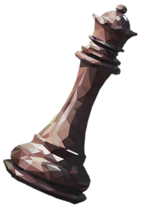

<h1> Wow, you found my Github! :unlock: </h1>

 So you found my hidden hole on the great big internet. I'm Thomas and I am trying my best to grow in knowledge about things from here and there. I graduated from University of Southern California with a degree in Computer Science and Computer Engineering back in 2019. I have also been dabbling with Capture the Flags and Hackathons since late highschool and have started to walk the route of penetration testing. Currently, I'm a tool developer and do a lot of programming in a wide variety of languages though I definitely prefer Python and Java. Anyhow, stay as long as you want and feel free to reach out to me. And remember: <b>Let's all have fun and play together!</b> 

## Programming Languages

## Stats

 

## Other Places I Hang Out

#### Codewars

#### Hack the Box

#### TryHackMe

... will add the rest later

---

 Remember to visit my website <a href="https://tjf952.github.io/">HERE</a> :star: 

